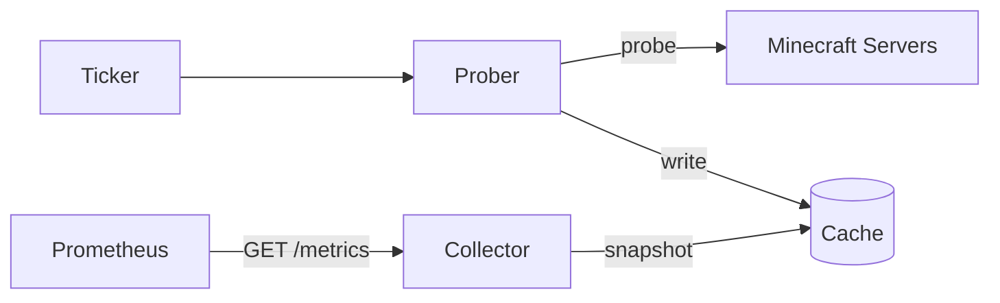

# mcping-exporter

[](https://github.com/Tobby-000/mcping-exporter/actions/workflows/ci.yml)
[](https://github.com/Tobby-000/mcping-exporter/actions/workflows/golangci-lint.yml)
[](go.mod)
[](https://github.com/Tobby-000/mcping-exporter/pkgs/container/mcping-exporter)

Minecraft 服务器状态监测的 Prometheus Exporter。提供在线状态、延迟、玩家数指标。

## 为什么

mc-monitor 在 `/metrics` handler 中同步探测，单个目标卡住会导致整个抓取超时。

本项目将探测与暴露解耦：后台异步探测写入缓存，`/metrics` 只读缓存，毫秒级返回。

## 特性

- 异步探测，缓存解耦
- 支持 SRV 记录解析
- 区分完整探测耗时与真实 RTT
- 并发探测，防周期重叠
- 目标热更新，修改配置无需重启


## TODO

- [ ] 可配置的 mock 服务器，用于本地并发压测与 CI 冒烟测试
- [ ] 配置加载失败时 dump 最后可用版本

## 快速开始

```bash
docker run -d \
  --name mcping-exporter \
  --restart unless-stopped \
  -p 9090:9090 \
  -v $(pwd)/config.yaml:/config.yaml:ro \
  ghcr.io/tobby-000/mcping-exporter:latest \
  --config /config.yaml
```

国内访问 ghcr.io 不佳时，可改用南京大学镜像：`ghcr.nju.edu.cn/tobby-000/mcping-exporter:latest`

## 配置

```yaml
# 复制为 config.yaml 后使用：
#   cp config.example.yaml config.yaml

# 探测基础设置
probe:
  # 探测周期，单位：秒，默认值：15
  interval: 15
  # 单次探测超时，单位：秒，默认值：5。必须小于 interval
  timeout: 5
  # 最大并发探测数，默认值：20
  limit: 20

# 目标设置
# 支持SRV，支持省去默认端口 25565
targets:
  - name: example1
    addr: example1.nil
  - name: example2
    addr: example2.nil:25565
```

`addr` 支持以下格式：

- 纯域名：自动查 SRV，无记录降级到 25565
- host:port：直接连接，不查 SRV
- IPv4 / IPv6：直接连接，IPv6 用方括号（[::1]:25565）


---


**命令行参数：**

| 参数 | 默认值 | 说明 |
| :--- | :--- | :--- |
| `--listen` | `:9090` | HTTP 监听地址|
| `--config` | `config.yaml` | 配置文件路径|

## 指标

| 指标 | 类型 | 说明 |
|:---| :--- | :--- |
| `minecraft_server_online`	| `Gauge`	| 1 在线，0 离线 |
| `minecraft_players_online`	| `Gauge`	| 在线玩家数 |
| `minecraft_ping_rtt_seconds`	| `Gauge`	| PING/PONG 往返耗时 |
| `minecraft_probe_total_duration_seconds` | `Gauge` | 从DNS到PING/PONG结束后总耗时 |


所有指标带 server 标签（配置中的 name）。失败时只暴露 `server_online 0`，其他指标不暴露。

`probe_total_duration` 是从 DNS 解析到 PING/PONG 结束的完整探测耗时，反映"从开始探测到拿到结果"的总开销。

## 架构


## Grafana Dashboard

[examples/dashboard.json](examples/dashboard.json) 提供了示例面板，包含：

- 服务器在线状态
- 在线人数
- PING/PONG 往返延迟
- 探测总耗时

导入方式：Grafana → Dashboards → Import → 上传 JSON 文件。导入时会提示选择数据源。


**注意：** 格式为 `dashboard.grafana.app/v2` ,不支持 Grafana 10.x 及以下版本。

## License

[Apache License 2.0](LICENSE)